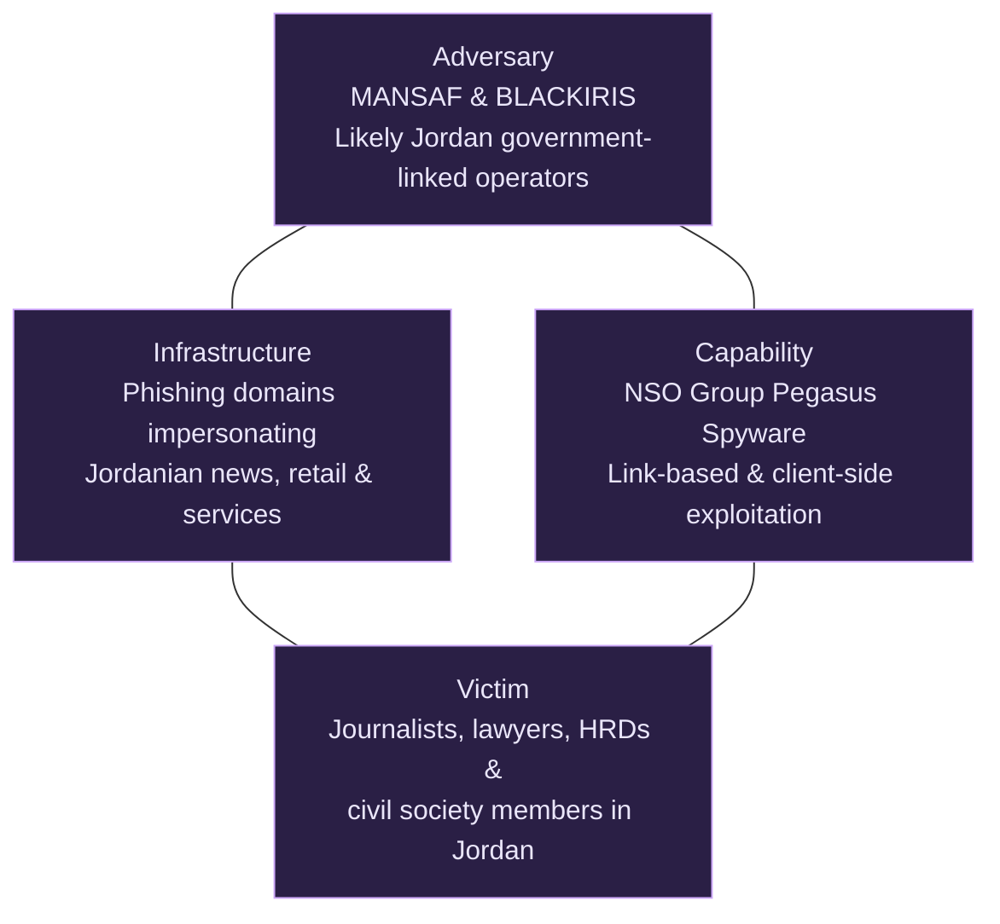
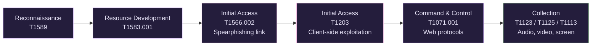
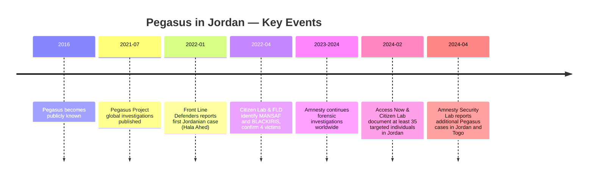

**TLP:CLEAR** &nbsp;|&nbsp; رقم التقرير: CTI-JO-2026-001 &nbsp;|&nbsp; المحلل: [اسمك] &nbsp;|&nbsp; النسخة 1.0

---

# مراقبة Pegasus للصحفيين والمدافعين عن حقوق الإنسان في الأردن

---

# الملخص التنفيذي

يحلل هذا التقرير حملة المراقبة باستخدام برنامج التجسس Pegasus التي استهدفت صحفيين ومحامين وناشطين ومدافعين عن حقوق الإنسان في الأردن.

كشفت تقارير نشرتها منظمة العفو الدولية (Amnesty International) وAccess Now وCitizen Lab أن برنامج التجسس Pegasus، الذي طورته الشركة الإسرائيلية NSO Group، استُخدم ضد أفراد من المجتمع المدني الأردني. تشير الأدلة المتاحة إلى أن البرنامج شُغّل بواسطة مشغّلَين محليَّين يُتابَعان تحت اسمي **MANSAF** و**BLACKIRIS**.

لم يكن اختيار الضحايا عشوائيًا. بل شارك الضحايا خصائص متشابهة، تشمل العمل الصحفي والقانوني والدفاع عن حقوق الإنسان والنشاط السياسي. وهذا يشير إلى أن الحملة نُفّذت لجمع معلومات استخباراتية عن أفراد لهم تأثير على الرأي العام والمجتمع المدني، لا لدوافع مالية.

يطبّق هذا التقرير **نموذج الماسة لتحليل الاختراقات (Diamond Model)** لتحليل الحملة من خلال دراسة الفاعل التهديدي والبنية التحتية والقدرات والضحايا. كما يربط السلوك المرصود بـ**إطار عمل MITRE ATT&CK** لفهم أفضل للتقنيات المستخدمة طوال العملية.

وأخيرًا، يقدّم التقرير تقييمًا استخباراتيًا، ويحدد الفجوات المعرفية المتبقية، ويناقش السياق السياسي الأوسع المحيط بالحملة.

---

# 2. سؤال البحث

يهدف هذا التقرير للإجابة على سؤال البحث التالي:

> **كيف استُخدم برنامج التجسس Pegasus لاستهداف الصحفيين والمدافعين عن حقوق الإنسان في الأردن، وماذا تكشف هذه الحملة عن الفاعل التهديدي والبنية التحتية والقدرات واختيار الضحايا والأهداف السياسية وراء العملية؟**

للإجابة على هذا السؤال، يركّز التقرير على خمسة مكونات استخباراتية.

## الفاعل التهديدي (Adversary)

تشير الأدلة المتاحة إلى أن Pegasus شُغّل بواسطة مشغّلَين محليَّين يُتابَعان باسمي **MANSAF** و**BLACKIRIS**. ورغم عدم وجود دليل علني يربط العملية مباشرة بالحكومة الأردنية، فإن نمط اختيار الضحايا والسلوك التشغيلي يشيران إلى أن الحملة كانت على الأرجح تخدم مصالح الحكومة الأردنية.

---

## البنية التحتية (Infrastructure)

اعتمد المشغّلون على نطاقات تصيّد وبنية تحتية للتحكم والسيطرة (C2) صُممت لانتحال شخصية مواقع أردنية موثوقة، ومنافذ إخبارية، وخدمات إلكترونية محلية. زادت هذه البنية التحتية من احتمالية ثقة الضحايا بالروابط الخبيثة وتفاعلهم مع مواقع يسيطر عليها المهاجمون.

---

## القدرة (Capability)

يوفّر Pegasus قدرات مراقبة واسعة بمجرد اختراق الجهاز. تشمل هذه القدرات جمع الرسائل والبريد الإلكتروني والصور وجهات الاتصال وكلمات المرور وبيانات الموقع الجغرافي، بالإضافة إلى تفعيل الميكروفون والكاميرا عن بُعد دون علم الضحية.

---

## الضحية (Victim)

استهدفت الحملة بشكل أساسي صحفيين ومحامين وناشطين وأعضاء في الفريق القانوني المدافع عن نقابة المعلمين الأردنية (JTS)، ومدافعين عن حقوق الإنسان. اختير هؤلاء الأفراد بسبب نشاطهم المهني وتأثيرهم العام وانخراطهم في المجتمع المدني.

---

## الإسناد (Attribution)

رغم أن الباحثين لم ينسبوا الحملة علنًا للحكومة الأردنية بشكل مباشر، تشير الأدلة المتاحة إلى أن المشغّلين كانوا على الأرجح يعملون لخدمة مصالح الحكومة الأردنية. يستند هذا التقييم إلى اختيار الضحايا، والبنية التحتية، والسلوك التشغيلي، وحقيقة أن Pegasus يُباع حصريًا لعملاء حكوميين.

---

# 3. الخلفية

Pegasus برنامج تجسس طوّرته شركة الأسلحة السيبرانية الإسرائيلية **NSO Group**. صُمم للتثبيت سرًا على أجهزة iOS وAndroid، بما يسمح للمشغّلين بمراقبة الضحايا دون علمهم.

بمجرد تثبيته، يمنح Pegasus المشغّل قدرات مراقبة واسعة. يمكنه اعتراض الرسائل والبريد الإلكتروني والمكالمات الهاتفية وبيانات التطبيقات، وجمع الملفات المخزّنة وكلمات المرور، وتتبّع موقع الضحية، وتفعيل الميكروفون والكاميرا عن بُعد. هذه القدرات تجعل Pegasus أحد أكثر أدوات المراقبة التجارية تقدمًا المعروفة علنًا.

لفت Pegasus الانتباه الدولي بعد أن كشفت تحقيقات متعددة استخدامه ضد صحفيين وناشطين ومحامين وسياسيين وأفراد من المجتمع المدني في عدة دول. وثّقت تقارير نشرتها Citizen Lab وAmnesty International وAccess Now حالات متكررة استُخدم فيها البرنامج خارج أغراض إنفاذ القانون المشروعة، واستُهدف بدلاً من ذلك أفراد منخرطون في العمل الصحفي وحقوق الإنسان والنشاط السياسي.

في الأردن، حدد الباحثون مشغّلَين لـ Pegasus، يُتابَعان باسمي **MANSAF** و**BLACKIRIS**، مسؤولين عن نشاط المراقبة المرصود. ورغم عدم وجود دليل علني يربط الحملة مباشرة بالحكومة الأردنية، قيّم المحققون أن المشغّلين كانا على الأرجح مرتبطَين بمصالح الحكومة الأردنية استنادًا إلى اختيار الضحايا، والأنماط التشغيلية، وخصائص البنية التحتية، وحقيقة أن Pegasus يُباع حصريًا لجهات حكومية.

يحلل هذا التقرير الحملة باستخدام **نموذج الماسة لتحليل الاختراقات** لفهم العلاقة بين الفاعل التهديدي والبنية التحتية والقدرة والضحايا. كما يربط السلوكيات المرصودة بـ**إطار عمل MITRE ATT&CK** لتحديد التقنيات المستخدمة خلال العملية وفهم أفضل لأساليب المهاجمين وأهدافهم.

---

# 4. التحليل التقني

*شكل 1 — تطبيق نموذج الماسة على حملة MANSAF / BLACKIRIS.*

## 4.1 الفاعل التهديدي

تشير الأدلة المتاحة إلى أن حملة المراقبة نُفّذت باستخدام برنامج Pegasus الذي شغّله مشغّلان محليان حددتهما Citizen Lab باسمي **MANSAF** و**BLACKIRIS**.

على عكس الجماعات الإجرامية السيبرانية ذات الدوافع المالية، ركّز هذان المشغّلان على جمع استخباراتي طويل المدى ضد صحفيين ومحامين وناشطين وأفراد من المجتمع المدني. يُظهر اختيار الضحايا نمطًا ثابتًا لا استهدافًا عشوائيًا.

قيّم الباحثون أن المشغّلَين كانا على الأرجح مرتبطَين بمصالح الحكومة الأردنية. يستند هذا التقييم إلى عدة عوامل، منها البيع الحصري لـ Pegasus لعملاء حكوميين، والتشابه بين الضحايا، والسلوك التشغيلي للحملة، والبنية التحتية المستخدمة خلال الهجمات.

رغم عدم وجود دليل علني يربط العملية مباشرة بالحكومة الأردنية، تشير الأدلة المتاحة إلى أن الحملة كانت بدوافع سياسية وصُممت لجمع معلومات استخباراتية عن أفراد منخرطين في العمل الصحفي والدفاع عن حقوق الإنسان والنشاط السياسي.

### التقييم

تشير الأدلة إلى أن MANSAF وBLACKIRIS عملا كمشغّلَين مرتبطَين بجهة حكومية كان هدفهما الأساسي جمع المعلومات الاستخباراتية لا الكسب المالي. يشير اختيار الضحايا والسلوك التشغيلي واستخدام برنامج تجسس حصري للحكومات إلى حملة مراقبة بدوافع سياسية.

---

# 4.2 البنية التحتية

اعتمدت الحملة على بنية تحتية للتصيّد صُممت خصيصًا لتبدو شرعية للمستخدمين الأردنيين. بدلاً من استخدام أسماء نطاقات عشوائية، سجّل المشغّلون نطاقات تحاكي مواقع إخبارية وشركات وخدمات إلكترونية محلية موثوقة.

من أمثلة النطاقات المحددة:

| النطاق | الوصف |
| --- | --- |
| alrainew[.]com | انتحل شخصية صحيفة الرأي الأردنية |
| al-taleanewsonline[.]net | انتحل شخصية موقع الطليعة الإخباري |
| al7erak247[.]com | يشير إلى حراك أردني |
| www.al7eraknews[.]com | يشير إلى حركات الاحتجاج السياسي |
| www.hona-alrabe3[.]com | يشير إلى منطقة الدوار الرابع في عمّان |
| talabatt[.]net | انتحل شخصية تطبيق طلبات |
| cozmo-store[.]net | انتحل شخصية متاجر Cozmo |
| mangoutlet[.]net | يشير إلى ماركة Mango للملابس |
| login-service[.]net | انتحال عام لصفحة تسجيل دخول |
| mobiles-security[.]net | نطاق تصيّد بموضوع تقني |
| akhbarnew[.]com | موقع إخباري وهمي |
| akhbar-almasdar[.]com | موقع إخباري وهمي |
| akhbar-islamyah[.]com | موقع إخباري وهمي |
| rss-me[.]com | بنية تحتية للتصيّد |
| unsubscribe-now[.]net | نطاق هندسة اجتماعية |
| khilafah-islamic[.]com | نطاق تصيّد بموضوع محدد |
| arabia-islamion[.]com | نطاق تصيّد بموضوع محدد |
| al-nusr[.]net | بنية تحتية للتصيّد |

صُممت هذه النطاقات لزيادة احتمالية ثقة الضحايا بروابط التصيّد باستخدام أسماء مألوفة مرتبطة بالأخبار والشركات والمواضيع السياسية الأردنية.

بعد تفاعل الضحية، تواصل Pegasus مع خوادم تحكم وسيطرة يسيطر عليها المهاجمون لتلقّي الأوامر وتسريب المعلومات المجمّعة.

### التقييم

تُظهر البنية التحتية هندسة اجتماعية متعمَّدة لا تصيّدًا جماعيًا عشوائيًا. من خلال انتحال شخصية مواقع وخدمات أردنية موثوقة، زاد المهاجمون من احتمالية نجاح تفاعل الضحية مع الحفاظ على أمن العمليات.

---

# 4.3 القدرة

يُعد Pegasus أحد أكثر منصات التجسس التجارية تقدمًا المعروفة علنًا. بمجرد تثبيته، يمنح المشغّلين قدرات مراقبة كاملة على جهاز الضحية المحمول.

تشمل القدرات الموثّقة:

- جمع رسائل SMS ومحادثات المراسلة الفورية.
- الوصول إلى البريد الإلكتروني والمستندات المخزّنة.
- جمع الصور ومقاطع الفيديو.
- الوصول إلى قوائم جهات الاتصال وسجل المكالمات.
- تتبّع الموقع الجغرافي عبر GPS.
- تفعيل الميكروفون عن بُعد.
- تفعيل الكاميرا عن بُعد.
- جمع كلمات المرور ورموز المصادقة.
- مراقبة نشاط التطبيقات.
- التواصل المستمر مع بنية التحكم والسيطرة.

تتيح هذه القدرات للمشغّلين إجراء جمع استخباراتي طويل المدى دون علم الضحية.

### التقييم

يمنح Pegasus أجهزة الاستخبارات وصولًا دائمًا لمعلومات بالغة الحساسية مخزّنة على الأجهزة المحمولة. في هذه الحملة، مكّنت هذه القدرات المشغّلين من مراقبة الاتصالات، وتحديد الشبكات الاجتماعية، وجمع معلومات متعلقة بالعمل الصحفي والنشاط السياسي وحقوق الإنسان.

---

# 4.4 ربط MITRE ATT&CK

| التكتيك | التقنية | المعرّف | الدليل | التقييم | مستوى الثقة |
| --- | --- | --- | --- | --- | --- |
| الاستطلاع (Reconnaissance) | جمع معلومات هوية الضحية | T1589 | شمل الضحايا صحفيين ومحامين وناشطين ومدافعين عن حقوق الإنسان حُددوا عبر تقارير علنية. | اختير الضحايا بشكل متعمَّد بناءً على نشاطهم وتأثيرهم داخل المجتمع المدني. | متوسط |
| تطوير الموارد (Resource Development) | حيازة بنية تحتية: نطاقات | T1583.001 | حُددت عدة نطاقات تصيّد تنتحل شخصية منظمات أردنية. | طُوّرت البنية التحتية خصيصًا لدعم عمليات التصيّد. | مرتفع |
| الوصول الأولي (Initial Access) | رابط تصيّد موجّه | T1566.002 | وثّقت Citizen Lab وAmnesty International وAccess Now روابط تصيّد أُرسلت للضحايا. | تدعم الأدلة مباشرة التصيّد كوسيلة إصابة أساسية. | مرتفع |
| الوصول الأولي (Initial Access) | استغلال للتنفيذ على جهاز العميل | T1203 | نفّذ Pegasus كودًا خبيثًا بنجاح بعد تفاعل الضحية. | تؤكد التقارير العلنية نجاح اختراق الجهاز، رغم عدم الكشف عن تفاصيل الثغرة. | متوسط |
| القيادة والسيطرة (C2) | بروتوكولات الويب | T1071.001 | تواصلت الأجهزة المخترقة مع بنية تحكم وسيطرة Pegasus عبر بروتوكولات الويب. | متسق مع عمليات Pegasus الموثّقة. | مرتفع |
| الجمع (Collection) | التقاط الصوت | T1123 | يدعم Pegasus تسجيل الميكروفون سرًا. | القدرة موثّقة، لكن لا يمكن تأكيد استخدامها ضد كل ضحية أردنية. | متوسط |
| الجمع (Collection) | التقاط الفيديو | T1125 | يدعم Pegasus تفعيل الكاميرا سرًا. | القدرة موثّقة، لكن لم يُؤكَّد استخدامها التشغيلي علنًا في كل حالة. | متوسط |
| الجمع (Collection) | التقاط الشاشة | T1113 | يدعم Pegasus وظيفة التقاط الشاشة. | القدرة موجودة، رغم أن الدليل المباشر في هذه الحملة محدود. | متوسط |

*شكل 2 — مسار الهجوم المرصود مربوطًا بإطار MITRE ATT&CK.*

### التقييم

تُظهر التقنيات المرصودة دورة حياة مراقبة كاملة تبدأ بالاستطلاع والتصيّد، تليها اختراق الجهاز، والتواصل المستمر مع بنية القيادة والسيطرة، وجمع استخباراتي واسع. تتماشى الحملة بشكل وثيق مع أساليب Pegasus المعروفة والموثّقة في تحقيقات سابقة.

---

# 4.5 تحليل الضحايا

## فئات الضحايا

| الفئة | الدليل | سبب الاستهداف |
| --- | --- | --- |
| صحفيون | حُدد صحفيون استقصائيون ومستقلون بين الضحايا. | مراقبة نشاط التغطية الصحفية والمصادر السرية والتغطية الإعلامية. |
| مدافعون عن حقوق الإنسان | وثّقت Access Now استهداف عدة مدافعين بـ Pegasus. | جمع استخباراتي حول أنشطة المناصرة ومنظمات المجتمع المدني. |
| ناشطون سياسيون | حُدد ناشطون مرتبطون بحركات إصلاحية خلال التحقيقات. | مراقبة المعارضة السياسية وجهود التعبئة الجماهيرية. |
| الفريق القانوني لنقابة المعلمين الأردنية (JTS) | وثّقت Access Now (فبراير 2024) أن هالة أحد، عضوة الفريق القانوني المدافع عن نقابة المعلمين، كانت من بين من اخترق Pegasus أجهزتهم. | مراقبة مرتبطة بالدفاع القانوني عن نقابة عمالية خلال فترة توتر سياسي. |

---

## نمط الاستهداف

تُظهر الأدلة المتاحة أن الضحايا شاركوا خصائص متشابهة. كان معظمهم صحفيين أو محامين أو ناشطين أو أعضاء في منظمات المجتمع المدني. اختيروا بسبب نشاطهم المهني وتأثيرهم على الرأي العام لا لأسباب مالية.

---

## الأثر

أثّرت حملة المراقبة بشكل كبير على خصوصية الضحايا وأمنهم. زاد الوصول إلى الاتصالات الخاصة والصور والمستندات وبيانات الموقع من خطر كشف معلومات سرية، وتقويض النشاط المهني، وتسهيل التخويف أو الابتزاز.

وبعيدًا عن الضحايا المباشرين، يمكن لحملات من هذا النوع أن تخلق أثرًا رادعًا أوسع، إذ تُثني الصحفيين والناشطين وأفراد المجتمع المدني عن أداء عملهم بسبب القلق من المراقبة المستمرة.

---

## مخاطر خاصة بالنوع الاجتماعي

حددت الأبحاث أيضًا مخاطر إضافية للنساء المستهدفات بـ Pegasus، منها:

- كشف الاتصالات الخاصة.
- كشف الصور الشخصية.
- ارتفاع خطر الابتزاز.
- العنف القائم على النوع الاجتماعي بواسطة التكنولوجيا.
- انتهاكات جسيمة للخصوصية الشخصية.

---

## التقييم

تشير الأدلة المتاحة إلى أن اختيار الضحايا كان متعمَّدًا ومبنيًا على أهداف استخباراتية. استُهدف الأفراد باستمرار بسبب نشاطهم المهني، وانخراطهم في المجتمع المدني، أو تأثيرهم على الرأي العام. لا يبدو أن الحملة كانت بدوافع مالية، بل ركّزت على مراقبة طويلة المدى لأفراد ذوي أهمية سياسية.

---

# الجدول الزمني

| التاريخ | الحدث | الأهمية |
| --- | --- | --- |
| **2016** | أصبح Pegasus معروفًا علنًا بعد أن كشف باحثون استخدامه ضد ناشط حقوقي. | أثبت وجود أداة مراقبة تجارية متقدمة تُباع للحكومات. |
| **يوليو 2021** | نشر مشروع Pegasus Project تحقيقات حول إساءة استخدام Pegasus عالميًا. | لفت انتباهًا دوليًا لمراقبة الصحفيين والناشطين والسياسيين. |
| **يناير 2022** | أعلنت Front Line Defenders لأول مرة أن هاتف المحامية الأردنية هالة أحد أُصيب بـ Pegasus. | أول حالة Pegasus موثّقة علنًا في الأردن. |
| **أبريل 2022** | نشرت Citizen Lab وFront Line Defenders تحقيقًا مشتركًا حدد مشغّلَين لـ Pegasus باسمي **MANSAF** و**BLACKIRIS**، وأكد إصابة أربعة ضحايا بين أغسطس 2019 وديسمبر 2021. | ربط نشاط Pegasus بالأردن عبر التحليل التقني وتحليل الضحايا. |
| **2023–2024** | واصلت Amnesty International تحقيقاتها الجنائية الرقمية حول إصابات Pegasus عالميًا. | أثبت أن Pegasus ظل منصة مراقبة نشطة. |
| **فبراير 2024** | نشرت Access Now وCitizen Lab تحقيقًا مشتركًا وثّق استهداف 35 فردًا على الأقل في الأردن بين 2019 و2023، بينهم صحفيون ومحامون وناشطون وموظفان من Human Rights Watch. | كشف أن نطاق الحملة أكبر بكثير مما أظهرته نتائج 2022 الأصلية. |
| **أبريل 2024** | وثّق Amnesty Security Lab حالات إضافية مؤكدة لـ Pegasus في الأردن وتوغو. | يشير إلى أن برامج التجسس التجارية ما زالت تشكّل تهديدًا جديًا للصحفيين والمدافعين عن حقوق الإنسان عالميًا. |

---

# 6. السياق السياسي والإقليمي

لم تحدث حملة Pegasus بمعزل عن سياقها. جاءت في فترة كان الأردن يواجه فيها انتقادات متزايدة بشأن حرية التعبير، والقيود على المجتمع المدني، ومعاملة الصحفيين والناشطين. وفي الفترة نفسها، حظيت احتجاجات وحركات إصلاح سياسي عديدة باهتمام عام كبير، بما في ذلك الأنشطة المرتبطة بنقابة المعلمين الأردنية (JTS).

كان كثير من الضحايا المحددين منخرطين في العمل الصحفي أو حقوق الإنسان أو المناصرة القانونية أو النشاط السياسي. غالبًا ما شمل عملهم توثيق إجراءات الحكومة، والتواصل مع مصادر سرية، وتنظيم حملات مناصرة، ومناقشة قضايا سياسية حساسة. مراقبة هؤلاء الأفراد كانت ستوفّر معلومات استخباراتية قيّمة حول أنشطة المجتمع المدني والتطورات السياسية المستقبلية.

للحملة أيضًا بُعد إقليمي مهم. طوّرت Pegasus الشركة الإسرائيلية NSO Group، ويُباع حصريًا لعملاء حكوميين بعد موافقة تصدير من وزارة الدفاع الإسرائيلية. هذا يجعل Pegasus مختلفًا عن برامج الجريمة السيبرانية التقليدية، لأن عملاءه المستهدفين هم أجهزة حكومية لا جماعات إجرامية.

### التقييم

تشير الأدلة المتاحة إلى أن الحملة كانت في الأساس عملية جمع استخباراتي لا حملة جريمة سيبرانية بدوافع مالية. يشير اختيار الضحايا والسلوك التشغيلي واستخدام برنامج تجسس حصري للحكومات كلها إلى أهداف سياسية. أقيّم بثقة **متوسطة** أن الحملة خدمت مصالح الحكومة الأردنية من خلال مراقبة الصحفيين والناشطين والمحامين وأفراد المجتمع المدني. تستفيد إسرائيل أيضًا بشكل غير مباشر من خلال تصدير تكنولوجيا مراقبة متقدمة والتعاون الأمني الإقليمي، رغم عدم وجود دليل علني يشير لتورط إسرائيلي مباشر في اختيار أو مراقبة الضحايا الأردنيين.

---

# 7. التقييم

## النتائج الرئيسية

- استُخدم برنامج التجسس Pegasus بنجاح ضد صحفيين ومحامين وناشطين ومدافعين عن حقوق الإنسان في الأردن.
- حددت Citizen Lab مشغّلَين لـ Pegasus معروفَين باسمي **MANSAF** و**BLACKIRIS**.
- اعتمدت الحملة على نطاقات تصيّد انتحلت شخصية مواقع إخبارية وشركات وخدمات إلكترونية أردنية.
- شارك الضحايا خصائص مهنية واجتماعية متشابهة، ما يشير إلى استهداف متعمَّد.
- لا يوجد دليل يشير إلى أن الحملة كانت بدوافع مالية.
- وجد تحقيق لاحق مشترك بين Access Now وCitizen Lab (فبراير 2024) أن الحملة كانت أكبر بكثير مما وُثّق في البداية، إذ أكد استهداف 35 فردًا على الأقل في الأردن بين 2019 و2023 — أي ما يقارب تسعة أضعاف الأربعة ضحايا المحددين في تقرير 2022 الأصلي.

---

## التقييم الاستخباراتي

تُظهر الأدلة المتاحة أن الضحايا اختيروا بسبب نشاطهم المهني وتأثيرهم داخل المجتمع المدني الأردني. يبدو أن الحملة صُممت لجمع معلومات استخباراتية، ومراقبة الأنشطة السياسية، ورصد المنظمات المنخرطة في العمل الصحفي وحقوق الإنسان.

يشير استخدام Pegasus، إلى جانب تحليل الضحايا والبنية التحتية المرصودة، إلى أن المشغّلين كانا يجريان مراقبة طويلة المدى لا يسعيان لكسب مالي. ورغم أن التقارير العلنية لا تنسب العملية مباشرة للحكومة الأردنية، فإن الأدلة المتاحة تجعل من غير المرجح أن يكون اختيار الضحايا عشوائيًا أو بلا دافع سياسي.

---

## تقييم مستوى الثقة

| التقييم | مستوى الثقة | السبب |
| --- | --- | --- |
| استُخدم Pegasus ضد المجتمع المدني الأردني. | **مرتفع** | مدعوم بتحقيقات جنائية رقمية من Amnesty International وCitizen Lab وAccess Now. |
| شغّل MANSAF وBLACKIRIS الحملة. | **مرتفع** | موثّق باستمرار عبر تحقيقات Citizen Lab. |
| اختير الضحايا بشكل متعمَّد بسبب أدوارهم العامة. | **مرتفع** | مدعوم بملفات الضحايا والتقارير عبر تحقيقات متعددة. |
| خدمت الحملة مصالح الحكومة الأردنية. | **متوسط** | توجد أدلة ظرفية قوية، لكن لم يُؤكَّد إسناد رسمي علنًا. |
| شاركت إسرائيل مباشرة في عمليات المراقبة. | **منخفض** | تؤكد الأدلة العلنية فقط أن Pegasus طوّرته وصدّرته شركة إسرائيلية. لا يوجد دليل يربط مشغّلين إسرائيليين بهذه الحملة. |

---

# 8. الفجوات الاستخباراتية

رغم تحقيقات متعددة، لا تزال عدة أسئلة بلا إجابة.

### الفجوة 1

**ما كان الرد الرسمي للحكومة الأردنية؟**

لم تعترف السلطات الأردنية علنًا باستخدام Pegasus ضد الصحفيين والناشطين. لم يصدر أي تحقيق رسمي أو تفسير علني.

---

### الفجوة 2

**هل يمكن تأكيد جميع الضحايا المحددين علنًا؟**

طلب معظم الضحايا الموثّقين عدم الكشف عن هويتهم لأسباب أمنية. ونتيجة لذلك، يبقى العدد الكامل وهويات المستهدفين غير معروفَين.

---

### الفجوة 3

**ما أقوى دليل يربط MANSAF وBLACKIRIS بمصالح الحكومة الأردنية؟**

استند الباحثون في تقييمهم إلى اختيار الضحايا، والسلوك التشغيلي، وخصائص البنية التحتية. لكن لا يوجد دليل علني ينسب أيًا من المشغّلَين مباشرة لجهة حكومية أردنية محددة.

---

### الفجوة 4

**هل استمرت الحملة أو توسّعت منذ نتائج 2022 الأصلية؟**

أُجيب عنها جزئيًا. أكد تحقيق Access Now/Citizen Lab في فبراير 2024 أن الحملة كانت أكبر بكثير مما كان معروفًا في البداية، ووثّق تحديث Amnesty في أبريل 2024 حالات إضافية. يبقى غير واضح ما إذا استمر الاستهداف بعد 2024، ولم تُوثَّق علنًا أي حالات أردنية مؤكدة منذ ذلك الحين.

---

# 9. الخاتمة والتوصيات

حلل هذا التقرير حملة المراقبة التي استهدفت صحفيين ومحامين وناشطين ومدافعين عن حقوق الإنسان أردنيين باستخدام برنامج التجسس Pegasus.

اعتمدت الحملة على برنامج Pegasus الذي طورته الشركة الإسرائيلية NSO Group وشغّله مشغّلان محليان يُتابَعان باسمي **MANSAF** و**BLACKIRIS**. لم يكن اختيار الضحايا عشوائيًا، بل استُهدفوا بسبب عملهم وانخراطهم في المجتمع المدني وتأثيرهم على الرأي العام.

بمجرد تثبيته، يتيح Pegasus للمشغّلين مراقبة الضحايا وجمع معلومات بالغة الحساسية، تشمل الرسائل والبريد الإلكتروني وجهات الاتصال والصور وبيانات الموقع ومعلومات شخصية أخرى. كما يتيح تفعيل الميكروفون والكاميرا عن بُعد دون علم الضحية، ما يجعله منصة جمع استخباراتي قوية.

تسلّط نتائج هذا التقرير الضوء على أهمية تحسين الأمن الرقمي بين الصحفيين والمحامين والناشطين وأفراد المجتمع المدني. ينبغي على العاملين في هذه المجالات تطوير وعي أساسي بالأمن السيبراني، والتحقق من الروابط المشبوهة قبل فتحها، وتجنّب تحميل برامج من مصادر غير موثوقة، وتوخّي الحذر عند التواصل مع أفراد مجهولين عبر الإنترنت.

كما ينبغي على منظمات المجتمع المدني والمنظمات غير الحكومية تعزيز وضعها الأمني السيبراني من خلال توفير تدريب توعوي منتظم، ووضع سياسات أمن رقمي واضحة، وتطبيق أدوات تواصل آمنة، ووضع إجراءات للاستجابة لحالات الاشتباه بإصابة ببرامج التجسس.

وأخيرًا، من المهم تذكّر أن حملات المراقبة تستمر بالتطور مع تقدّم تقنيات برامج التجسس. لذا ينبغي اعتبار الوعي بالأمن السيبراني جزءًا أساسيًا من حماية الصحفيين والناشطين والمحامين والمدافعين عن حقوق الإنسان من عمليات المراقبة الحديثة.

---

# 10. المصادر

## المصادر الأساسية

- The Citizen Lab & Front Line Defenders, "Peace through Pegasus: Jordanian Human Rights Defenders and Journalists Hacked with Pegasus Spyware," أبريل 2022.
  https://citizenlab.ca/2022/04/peace-through-pegasus-jordanian-human-rights-defenders-and-journalists-hacked-with-pegasus-spyware/

- Front Line Defenders, "Report: Jordanian Human Rights Defenders and Journalists Hacked with Pegasus Spyware," 2022.
  https://www.frontlinedefenders.org/en/statement-report/report-jordanian-human-rights-defenders-and-journalists-hacked-pegasus-spyware

- Access Now & The Citizen Lab, "Between a Hack and a Hard Place: How Pegasus Spyware Crushes Civic Space in Jordan," 1 فبراير 2024.
  https://www.accessnow.org/publication/between-a-hack-and-a-hard-place-how-pegasus-spyware-crushes-civic-space-in-jordan/

- The Citizen Lab, "Confirming Large-Scale Pegasus Surveillance of Jordan-based Civil Society," 2024.
  https://citizenlab.ca/confirming-large-scale-pegasus-surveillance-of-jordan-based-civil-society/

- Amnesty International Security Lab, "Partner Research Update: New Cases of Pegasus in Jordan and Togo," أبريل 2024.
  https://securitylab.amnesty.org/latest/2024/04/partner-research-update-new-cases-of-pegasus-in-jordan-and-togo/

- Amnesty International, "Forensic Methodology Report: How to Catch NSO Group's Pegasus," يوليو 2021.
  https://www.amnesty.org/en/latest/research/2021/07/forensic-methodology-report-how-to-catch-nso-groups-pegasus/

## الأطر المنهجية

- Sergio Caltagirone, Andrew Pendergast, Christopher Betz, "The Diamond Model of Intrusion Analysis," 2013.
- إطار عمل MITRE ATT&CK. https://attack.mitre.org

## مراجع مؤشرات الاختراق (IOC)

- استُخلصت مؤشرات النطاقات والبنية التحتية من تحقيق Citizen Lab/Front Line Defenders في أبريل 2022، والتحقيق المشترك بين Access Now وCitizen Lab في فبراير 2024 (انظر المصادر الأساسية أعلاه).

## مراجع داعمة

- تصريحات NSO Group العلنية.
- المركز الوطني الأردني للأمن السيبراني، بيان نفي علني، أبريل 2022.
