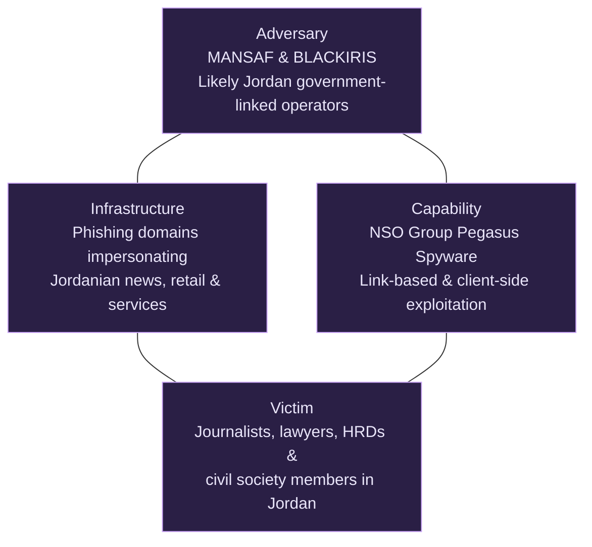
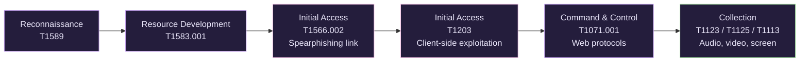
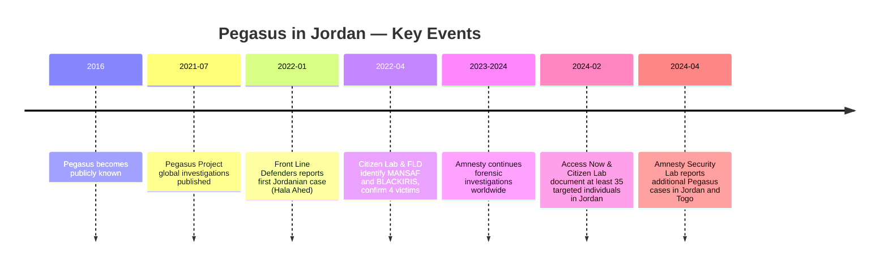

**TLP:CLEAR** &nbsp;|&nbsp; Report ID: CTI-JO-2026-001 &nbsp;|&nbsp; Analyst: [Your name] &nbsp;|&nbsp; Version 1.0

---

# Pegasus Surveillance of Journalists and Human Rights Defenders in Jordan

---

# Executive Summary

This report analyzes the Pegasus surveillance campaign that targeted journalists, lawyers, activists, and human rights defenders in Jordan.

Reports published by Amnesty International, Access Now, and Citizen Lab revealed that Pegasus spyware, developed by the Israeli company NSO Group, was used against members of Jordanian civil society. The available evidence indicates that the spyware was operated by two local Pegasus operators tracked as **MANSAF** and **BLACKIRIS**.

The victims were not selected randomly. Instead, they shared similar characteristics, including journalism, legal work, human rights advocacy, and political activism. This suggests that the campaign was conducted to collect intelligence on individuals who had influence over public opinion and civil society rather than for financial gain.

This report applies the **Diamond Model of Intrusion Analysis** to analyze the campaign by examining the adversary, infrastructure, capabilities, and victims. It also maps the observed behavior to the **MITRE ATT&CK Framework** to better understand the techniques used throughout the operation.

Finally, the report provides an intelligence assessment, identifies remaining intelligence gaps, and discusses the broader political context surrounding the campaign.

---

# 2. Research Question

This report aims to answer the following research question:

> **How was Pegasus spyware used to target journalists and human rights defenders in Jordan, and what does this campaign reveal about the adversary, infrastructure, capabilities, victim selection, and political objectives behind the operation?**

To answer this question, the report focuses on five intelligence components.

## Adversary

The available evidence indicates that Pegasus was operated by two local operators tracked as **MANSAF** and **BLACKIRIS**. Although no public evidence directly attributes the operation to the Jordanian government, the victim selection and operational patterns suggest that the campaign likely supported Jordanian government interests.

---

## Infrastructure

The operators relied on phishing domains and command-and-control infrastructure designed to impersonate trusted Jordanian websites, news outlets, and local online services. This infrastructure increased the likelihood that victims would trust malicious links and interact with attacker-controlled websites.

---

## Capability

Pegasus provides extensive surveillance capabilities once a device has been compromised. These capabilities include collecting messages, emails, photographs, contacts, passwords, and location data, as well as remotely activating the microphone and camera without the victim's knowledge.

---

## Victim

The campaign primarily targeted journalists, lawyers, activists, members of the Jordanian Teachers Syndicate's (JTS) legal defense team, and human rights defenders. These individuals were selected because of their professional activities, public influence, and involvement in civil society.

---

## Attribution

Although researchers have not publicly attributed the campaign directly to the Jordanian government, the available evidence suggests that the operators were likely acting in support of Jordanian government interests. This assessment is based on victim selection, infrastructure, operational behavior, and the fact that Pegasus is sold exclusively to government customers.

---

# 3. Background

Pegasus is spyware developed by the Israeli cyber-arms company **NSO Group**. It is designed to be secretly installed on iOS and Android devices, allowing operators to monitor victims without their knowledge.

Once installed, Pegasus gives the operator extensive surveillance capabilities. It can intercept messages, emails, phone calls, and application data, collect stored files and passwords, track the victim's location, and remotely activate the device's microphone and camera. These capabilities make Pegasus one of the most advanced commercial surveillance tools publicly known.

Pegasus attracted international attention after multiple investigations revealed that it had been used against journalists, activists, lawyers, politicians, and members of civil society in several countries. Reports published by Citizen Lab, Amnesty International, and Access Now documented repeated cases in which the spyware was used beyond legitimate law enforcement purposes and instead targeted individuals engaged in journalism, human rights work, and political activities.

In Jordan, researchers identified two Pegasus operators, tracked as **MANSAF** and **BLACKIRIS**, that were responsible for the observed surveillance activity. Although no public evidence directly attributes the campaign to the Jordanian government, investigators assessed that the operators were likely associated with Jordanian government interests based on victim selection, operational patterns, infrastructure characteristics, and the fact that Pegasus is exclusively sold to government entities.

This report analyzes the campaign using the **Diamond Model of Intrusion Analysis** to understand the relationship between the adversary, infrastructure, capability, and victims. It also maps the observed behaviors to the **MITRE ATT&CK Framework** to identify the techniques used during the operation and better understand the attackers' methods and objectives.

---

# 4. Technical Analysis

*Figure 1 — Diamond Model applied to the MANSAF / BLACKIRIS campaign.*

## 4.1 Adversary

The available evidence indicates that the surveillance campaign was conducted using Pegasus spyware operated by two local operators identified by Citizen Lab as **MANSAF** and **BLACKIRIS**.

Unlike financially motivated cybercriminal groups, these operators focused on long-term intelligence collection against journalists, lawyers, activists, and members of civil society. Their victim selection demonstrates a consistent pattern rather than random targeting.

Researchers assessed that both operators were likely associated with Jordanian government interests. This assessment is based on several factors, including the exclusive sale of Pegasus to government customers, the similarity between the victims, the operational behavior of the campaign, and the infrastructure used during the attacks.

Although no public evidence directly attributes the operation to the Jordanian government, the available evidence suggests that the campaign was politically motivated and designed to collect intelligence on individuals involved in journalism, human rights advocacy, and political activism.

### Assessment

The evidence suggests that MANSAF and BLACKIRIS operated as government-linked Pegasus operators whose primary objective was intelligence collection rather than financial gain. Their victim selection, operational behavior, and use of government-exclusive spyware indicate a politically motivated surveillance campaign.

---

# 4.2 Infrastructure

The campaign relied on phishing infrastructure specifically designed to appear legitimate to Jordanian users. Rather than using random domain names, the operators registered domains that imitated trusted local news websites, businesses, and online services.

Examples of identified domains include:

| Domain | Description |
| --- | --- |
| alrainew[.]com | Impersonated the Jordanian newspaper Al Rai |
| al-taleanewsonline[.]net | Impersonated Al Talea News |
| al7erak247[.]com | Referenced the Jordanian Hirak movement |
| www.al7eraknews[.]com | Referenced political protest movements |
| www.hona-alrabe3[.]com | Referenced the Fourth Circle protest area in Amman |
| talabatt[.]net | Impersonated Talabat |
| cozmo-store[.]net | Impersonated Cozmo retail stores |
| mangoutlet[.]net | Referenced Mango clothing retailer |
| login-service[.]net | Generic login impersonation |
| mobiles-security[.]net | Technology-themed phishing domain |
| akhbarnew[.]com | Fake news website |
| akhbar-almasdar[.]com | Fake news website |
| akhbar-islamyah[.]com | Fake news website |
| rss-me[.]com | Phishing infrastructure |
| unsubscribe-now[.]net | Social engineering domain |
| khilafah-islamic[.]com | Themed phishing domain |
| arabia-islamion[.]com | Themed phishing domain |
| al-nusr[.]net | Phishing infrastructure |

These domains were designed to increase the likelihood that victims would trust phishing links by using familiar names related to Jordanian news, businesses, and political topics.

After victim interaction, Pegasus communicated with attacker-controlled command-and-control servers to receive instructions and exfiltrate collected information.

### Assessment

The infrastructure demonstrates deliberate social engineering rather than mass phishing. By impersonating trusted Jordanian websites and services, the attackers increased the probability of successful victim interaction while maintaining operational security.

---

# 4.3 Capability

Pegasus is one of the most advanced commercial spyware platforms publicly known. Once installed, it provides operators with complete surveillance capabilities over the victim's mobile device.

Documented capabilities include:

- Collection of SMS messages and instant messaging conversations.
- Access to emails and stored documents.
- Collection of photographs and videos.
- Access to contact lists and call history.
- GPS location tracking.
- Remote activation of the microphone.
- Remote activation of the camera.
- Collection of passwords and authentication tokens.
- Monitoring application activity.
- Continuous communication with command-and-control infrastructure.

These capabilities allow operators to conduct long-term intelligence collection without the victim's knowledge.

### Assessment

Pegasus provides intelligence agencies with persistent access to highly sensitive information stored on mobile devices. In this campaign, these capabilities enabled operators to monitor communications, identify social networks, and collect information related to journalism, political activities, and human rights work.

---

# 4.4 MITRE ATT&CK Mapping

| Tactic | Technique | ID | Evidence | Assessment | Confidence |
| --- | --- | --- | --- | --- | --- |
| Reconnaissance | Gather Victim Identity Information | T1589 | Victims included journalists, lawyers, activists, and human rights defenders identified through public reporting. | Victims were deliberately selected based on their activities and influence within civil society. | Medium |
| Resource Development | Acquire Infrastructure: Domains | T1583.001 | Multiple phishing domains impersonating Jordanian organizations were identified. | Infrastructure was specifically developed to support phishing operations. | High |
| Initial Access | Spearphishing Link | T1566.002 | Citizen Lab, Amnesty International, and Access Now documented phishing links delivered to victims. | Evidence directly supports phishing as the primary infection method. | High |
| Initial Access | Exploitation for Client Execution | T1203 | Pegasus successfully executed malicious code after victim interaction. | Public reports confirm successful device compromise, although exploit details remain undisclosed. | Medium |
| Command and Control | Web Protocols | T1071.001 | Compromised devices communicated with Pegasus command-and-control infrastructure over web protocols. | Consistent with documented Pegasus operations. | High |
| Collection | Audio Capture | T1123 | Pegasus supports covert microphone recording. | Capability is documented, but its use against every Jordanian victim cannot be confirmed. | Medium |
| Collection | Video Capture | T1125 | Pegasus supports covert camera activation. | Capability is documented, but operational use was not publicly confirmed in every case. | Medium |
| Collection | Screen Capture | T1113 | Pegasus supports screen capture functionality. | Capability exists, although direct evidence in this campaign is limited. | Medium |

*Figure 2 — Observed attack workflow mapped to MITRE ATT&CK.*

### Assessment

The observed techniques demonstrate a complete surveillance lifecycle beginning with reconnaissance and phishing, followed by device compromise, persistent command-and-control communication, and extensive intelligence collection. The campaign closely aligns with known Pegasus tradecraft documented in previous investigations.

---

# 4.5 Victim Analysis

## Categories of Victims

| Category | Evidence | Reason for Targeting |
| --- | --- | --- |
| Journalists | Investigative reporters and independent journalists were identified among victims. | Monitoring reporting activities, confidential sources, and media coverage. |
| Human Rights Defenders | Access Now documented multiple defenders targeted by Pegasus. | Intelligence collection on advocacy activities and civil society organizations. |
| Political Activists | Activists associated with reform movements were identified during investigations. | Monitoring political opposition and public mobilization efforts. |
| Jordanian Teachers Syndicate (JTS) Legal Team | Access Now (February 2024) documented that Hala Ahed, a member of the legal team defending JTS, was among the individuals whose device was compromised with Pegasus. | Surveillance linked to legal defense of a labor union during a period of political tension. |

---

## Targeting Pattern

The available evidence shows that the victims shared similar characteristics. Most of them were journalists, lawyers, activists, or members of civil society organizations. They were selected because of their professional activities and their influence on public opinion rather than for financial reasons.

---

## Impact

The surveillance campaign significantly affected the privacy and security of the victims. Access to private communications, photographs, documents, and location data increased the risk of exposing confidential information, compromising professional activities, and facilitating intimidation or blackmail.

Beyond the direct victims, campaigns of this nature can create a broader chilling effect by discouraging journalists, activists, and members of civil society from carrying out their work due to concerns about constant surveillance.

---

## Gender-Specific Risks

Research also identified additional risks for women targeted by Pegasus, including:

- Exposure of private communications.
- Exposure of personal photographs.
- Increased risk of blackmail.
- Technology-facilitated gender-based violence.
- Serious violations of personal privacy.

---

## Assessment

The available evidence indicates that victim selection was deliberate and intelligence-driven. Individuals were consistently targeted because of their professional activities, involvement in civil society, or influence over public opinion. The campaign does not appear to have been financially motivated but instead focused on long-term surveillance of politically significant individuals.

---

# Timeline

| Date | Event | Importance |
| --- | --- | --- |
| **2016** | Pegasus became publicly known after researchers revealed its use against a human rights activist. | Demonstrated the existence of advanced commercial spyware sold to governments. |
| **July 2021** | The Pegasus Project published investigations into the global misuse of Pegasus. | Brought international attention to the surveillance of journalists, activists, and politicians. |
| **January 2022** | Front Line Defenders first reported that Jordanian lawyer Hala Ahed's phone was infected with Pegasus. | First publicly documented Pegasus case in Jordan. |
| **April 2022** | Citizen Lab and Front Line Defenders published a joint investigation identifying two Pegasus operators, tracked as **MANSAF** and **BLACKIRIS**, and confirmed four victims infected between August 2019 and December 2021. | Linked Pegasus activity to Jordan through technical analysis and victimology. |
| **2023–2024** | Amnesty International continued forensic investigations into Pegasus infections worldwide. | Demonstrated that Pegasus remained an active surveillance platform. |
| **February 2024** | Access Now and Citizen Lab published a joint investigation documenting at least 35 targeted individuals in Jordan between 2019 and 2023, including journalists, lawyers, activists, and two Human Rights Watch staff. | Revealed the campaign was significantly larger in scale than the original 2022 findings. |
| **April 2024** | Amnesty International Security Lab reported additional confirmed Pegasus cases in Jordan and Togo. | Indicates that commercial spyware continues to pose a serious threat to journalists and human rights defenders worldwide. |

---

# 6. Political and Regional Context

The Pegasus campaign did not occur in isolation. It took place during a period in which Jordan was facing increasing criticism regarding freedom of expression, restrictions on civil society, and the treatment of journalists and activists. During the same period, several protests and political reform movements received significant public attention, including the activities surrounding the Jordanian Teachers Syndicate (JTS).

Many of the identified victims were involved in journalism, human rights work, legal advocacy, or political activism. Their work often included documenting government actions, communicating with confidential sources, organizing advocacy campaigns, and discussing sensitive political issues. Monitoring these individuals would provide valuable intelligence about civil society activities and future political developments.

The campaign also has an important regional dimension. Pegasus is developed by the Israeli company NSO Group and is sold exclusively to government customers after export approval by the Israeli Ministry of Defense. This makes Pegasus different from traditional cybercrime malware because its intended customers are government agencies rather than criminal groups.

### Assessment

The available evidence suggests that the campaign was primarily an intelligence collection operation rather than a financially motivated cybercrime campaign. The victim selection, operational behavior, and use of government-exclusive spyware all indicate political objectives. I assess with **medium confidence** that the campaign supported Jordanian government interests by monitoring journalists, activists, lawyers, and members of civil society. Israel also benefits indirectly through the export of advanced surveillance technology and regional security cooperation, although no public evidence indicates direct Israeli involvement in selecting or monitoring the Jordanian victims.

---

# 7. Assessment

## Key Findings

- Pegasus spyware was successfully used against journalists, lawyers, activists, and human rights defenders in Jordan.
- Citizen Lab identified two Pegasus operators known as **MANSAF** and **BLACKIRIS**.
- The campaign relied on phishing domains that impersonated Jordanian news websites, businesses, and online services.
- Victims shared similar professional and social characteristics, indicating deliberate targeting.
- No evidence suggests that the campaign was financially motivated.
- A subsequent joint investigation by Access Now and Citizen Lab (February 2024) found that the campaign was substantially larger than initially documented, confirming at least 35 targeted individuals in Jordan between 2019 and 2023 — nearly nine times the four victims identified in the original 2022 report.

---

## Intelligence Assessment

The available evidence shows that the victims were selected because of their professional activities and influence within Jordanian civil society. The campaign appears to have been designed to collect intelligence, monitor political activities, and observe organizations involved in journalism and human rights.

The use of Pegasus, together with the observed victimology and infrastructure, suggests that the operators were conducting long-term surveillance rather than seeking financial benefit. Although public reporting does not directly attribute the operation to the Jordanian government, the available evidence makes it unlikely that the victims were selected randomly or without political motivation.

---

## Confidence Assessment

| Assessment | Confidence | Reason |
| --- | --- | --- |
| Pegasus was used against Jordanian civil society. | **High** | Supported by forensic investigations from Amnesty International, Citizen Lab, and Access Now. |
| MANSAF and BLACKIRIS operated the campaign. | **High** | Consistently documented by Citizen Lab investigations. |
| Victims were deliberately selected because of their public roles. | **High** | Supported by victim profiles and reporting across multiple investigations. |
| The campaign supported Jordanian government interests. | **Medium** | Strong circumstantial evidence exists, but no official attribution has been publicly confirmed. |
| Israel directly participated in the surveillance operations. | **Low** | Public evidence only confirms that Pegasus was developed and exported by an Israeli company. No evidence links Israeli operators to this campaign. |

---

# 8. Intelligence Gaps

Despite multiple investigations, several questions remain unanswered.

### Gap 1

**What was the official response of the Jordanian government?**

Jordanian authorities have not publicly acknowledged the use of Pegasus against journalists and activists. No official investigation or public explanation has been released.

---

### Gap 2

**Can all identified victims be publicly confirmed?**

Most documented victims requested anonymity for security reasons. As a result, the complete number and identities of those targeted remain unknown.

---

### Gap 3

**What evidence most strongly links MANSAF and BLACKIRIS to Jordanian government interests?**

Researchers based their assessment on victim selection, operational behavior, and infrastructure characteristics. However, no public evidence directly attributes either operator to a specific Jordanian government agency.

---

### Gap 4

**Has the campaign continued or expanded since the original 2022 findings?**

Partially answered. The February 2024 Access Now/Citizen Lab investigation confirmed the campaign was far larger than initially known, and Amnesty's April 2024 update documented additional cases. It remains unclear whether targeting has continued beyond 2024, and no confirmed Jordanian cases have been publicly documented since.

---

# 9. Conclusion and Recommendations

This report analyzed the surveillance campaign that targeted Jordanian journalists, lawyers, activists, and human rights defenders using Pegasus spyware.

The campaign relied on Pegasus spyware developed by the Israeli company NSO Group and operated by two local operators tracked as **MANSAF** and **BLACKIRIS**. The victims were not selected randomly. Instead, they were targeted because of their work, involvement in civil society, and influence over public opinion.

Once installed, Pegasus allows operators to monitor victims and collect highly sensitive information, including messages, emails, contacts, photographs, location data, and other personal information. It also allows remote activation of the microphone and camera without the victim's knowledge, making it a powerful intelligence collection platform.

The findings of this report highlight the importance of improving digital security among journalists, lawyers, activists, and members of civil society. Individuals working in these fields should develop basic cybersecurity awareness, verify suspicious links before opening them, avoid downloading software from untrusted sources, and remain cautious when communicating with unknown individuals online.

Civil society organizations and non-governmental organizations should also strengthen their cybersecurity posture by providing regular awareness training, developing clear digital security policies, implementing secure communication tools, and establishing procedures for responding to suspected spyware incidents.

Finally, it is important to remember that surveillance campaigns continue to evolve as spyware technologies become more advanced. Cybersecurity awareness should therefore be considered an essential part of protecting journalists, activists, lawyers, and human rights defenders from modern surveillance operations.

---

# 10. Sources

## Primary Sources

- The Citizen Lab & Front Line Defenders, "Peace through Pegasus: Jordanian Human Rights Defenders and Journalists Hacked with Pegasus Spyware," April 2022.
  https://citizenlab.ca/2022/04/peace-through-pegasus-jordanian-human-rights-defenders-and-journalists-hacked-with-pegasus-spyware/

- Front Line Defenders, "Report: Jordanian Human Rights Defenders and Journalists Hacked with Pegasus Spyware," 2022.
  https://www.frontlinedefenders.org/en/statement-report/report-jordanian-human-rights-defenders-and-journalists-hacked-pegasus-spyware

- Access Now & The Citizen Lab, "Between a Hack and a Hard Place: How Pegasus Spyware Crushes Civic Space in Jordan," 1 February 2024.
  https://www.accessnow.org/publication/between-a-hack-and-a-hard-place-how-pegasus-spyware-crushes-civic-space-in-jordan/

- The Citizen Lab, "Confirming Large-Scale Pegasus Surveillance of Jordan-based Civil Society," 2024.
  https://citizenlab.ca/confirming-large-scale-pegasus-surveillance-of-jordan-based-civil-society/

- Amnesty International Security Lab, "Partner Research Update: New Cases of Pegasus in Jordan and Togo," April 2024.
  https://securitylab.amnesty.org/latest/2024/04/partner-research-update-new-cases-of-pegasus-in-jordan-and-togo/

- Amnesty International, "Forensic Methodology Report: How to Catch NSO Group's Pegasus," July 2021.
  https://www.amnesty.org/en/latest/research/2021/07/forensic-methodology-report-how-to-catch-nso-groups-pegasus/

## Frameworks

- Sergio Caltagirone, Andrew Pendergast, Christopher Betz, "The Diamond Model of Intrusion Analysis," 2013.
- MITRE ATT&CK Framework. https://attack.mitre.org

## IOC References

- Domain and infrastructure indicators derived from the April 2022 Citizen Lab/Front Line Defenders investigation and the February 2024 Access Now/Citizen Lab joint investigation (see Primary Sources above).

## Supporting References

- NSO Group public statements.
- Jordanian National Cyber Security Center, public denial statement, April 2022.
